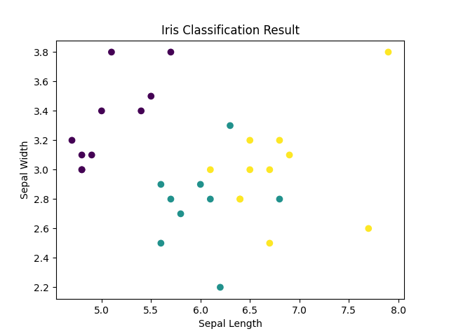

# Iris Flower Classification

This project classifies iris flowers into species using machine learning.

## Tools Used
- Python
- Pandas
- Scikit-learn

## Model
K-Nearest Neighbors (KNN)

## Result
The model achieved high accuracy (~95%+).

