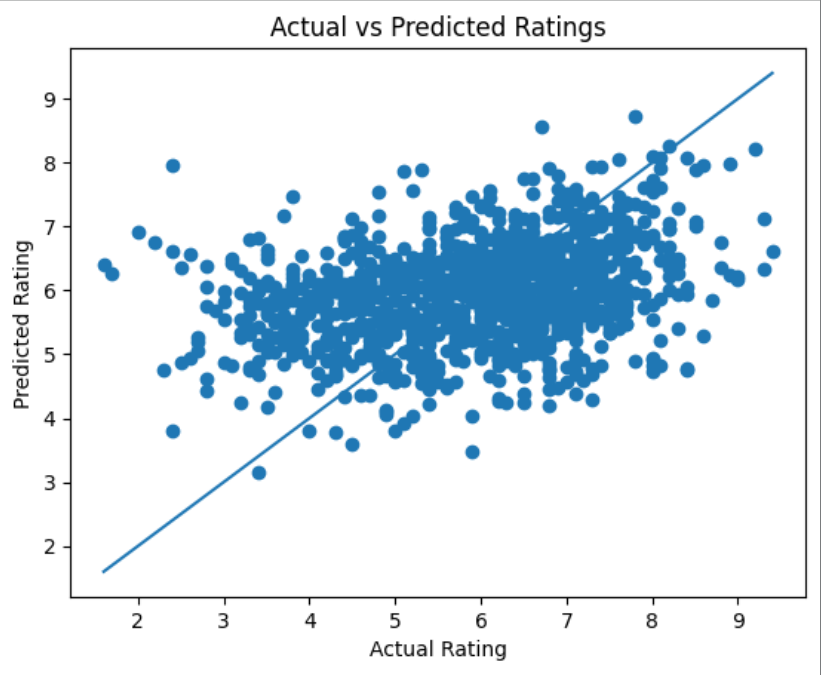

# Movie Rating Prediction

This project focuses on predicting movie ratings using machine learning techniques. The model analyzes features such as genre, duration, and number of votes to estimate the rating of a movie.

## 📊 Dataset
The dataset contains information about movies, including:
- Genre
- Duration
- Votes
- Rating

## ⚙️ Tools & Technologies
- Python
- Pandas
- NumPy
- Scikit-learn
- Matplotlib

## 🔍 Steps Performed
1. Data loading and exploration  
2. Handling missing values  
3. Data cleaning (Duration and Votes conversion)  
4. Feature selection  
5. Encoding categorical data (Genre)  
6. Train-test split  
7. Model training using Random Forest Regressor  
8. Model evaluation using R2 Score and Mean Squared Error  
9. Visualization of Actual vs Predicted ratings  

## 📈 Result
The model achieved a reasonable R2 score and was able to capture general trends in movie ratings.

The graph below shows the relationship between actual and predicted ratings:

## 🧠 Conclusion
- The model performs moderately well but tends to predict values near the average.
- More features (like actors, director, etc.) could improve performance.
- This project demonstrates the complete machine learning workflow from preprocessing to evaluation.

## 📁 Project Structure
